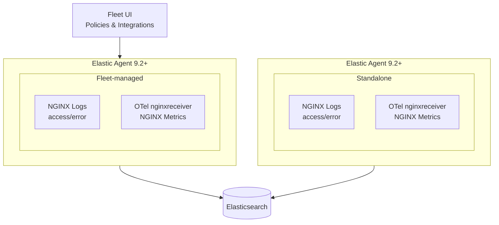

# Unlocking Flexibility: A Practical Guide to Elastic Agent in Hybrid Mode

##  1. <a name='TableofContent'></a>Table of Content

<!-- vscode-markdown-toc -->
* 1. [Table of Content](#TableofContent)
* 2. [Overview](#Overview)
* 3. [Prerequisites](#Prerequisites)
* 4. [Understanding Hybrid Collection in Elastic Agent](#UnderstandingHybridCollectioninElasticAgent)
	* 4.1. [Two Complementary Ingestion Paths - TO REVIEW](#TwoComplementaryIngestionPaths-TOREVIEW)
	* 4.2. [Hybrid Mode in Elastic Agent 9.2+](#HybridModeinElasticAgent9.2)
		* 4.2.1. [**A. Fleet-managed hybrid**](#A.Fleet-managedhybrid)
		* 4.2.2. [**B. Standalone hybrid**](#B.Standalonehybrid)
* 5. [Preparing NGINX](#PreparingNGINX)
	* 5.1. [Install NGINX](#InstallNGINX)
	* 5.2. [ Activate NGINX Metrics](#ActivateNGINXMetrics)
* 6. [Fleet Managed: Collecting NGINX Logs & Metrics](#FleetManaged:CollectingNGINXLogsMetrics)
	* 6.1. [Collecting NGINX Logs Using the Native Integration](#CollectingNGINXLogsUsingtheNativeIntegration)
		* 6.1.1. [Create an Agent Policy](#CreateanAgentPolicy)
		* 6.1.2. [Enroll Your Agent](#EnrollYourAgent)
		* 6.1.3. [Add the NGINX Integration (Logs Only)](#AddtheNGINXIntegrationLogsOnly)
		* 6.1.4. [Validate Log Collection](#ValidateLogCollection)
	* 6.2. [Collecting NGINX Metrics via the OTel NGINX Receiver](#CollectingNGINXMetricsviatheOTelNGINXReceiver)
		* 6.2.1. [Install the NGINX OpenTelemetry Integration Content](#InstalltheNGINXOpenTelemetryIntegrationContent)
		* 6.2.2. [Install the NGINX OpenTelemetry Input Integration](#InstalltheNGINXOpenTelemetryInputIntegration)
		* 6.2.3. [Validate OTel Metrics](#ValidateOTelMetrics)
* 7. [Standalone: Collecting NGINX Metrics & Logs via Standalone EDOT](#Standalone:CollectingNGINXMetricsLogsviaStandaloneEDOT)
	* 7.1. [Install the NGINX Integration Content](#InstalltheNGINXIntegrationContent)
	* 7.2. [Install the NGINX OpenTelemetry Integration Content](#InstalltheNGINXOpenTelemetryIntegrationContent-1)
	* 7.3. [Create a Local elastic-agent Configuration](#CreateaLocalelastic-agentConfiguration)
	* 7.4. [Validate Native Logs](#ValidateNativeLogs)
	* 7.5. [Validate OTel Metrics](#ValidateOTelMetrics-1)
* 8. [Conclusion](#Conclusion)
* 9. [References](#References)

<!-- vscode-markdown-toc-config
	numbering=true
	autoSave=true
	/vscode-markdown-toc-config -->
<!-- /vscode-markdown-toc -->


##  2. <a name='Overview'></a>Overview

Elastic Agent 9.2+ introduces a unified collection model where **Elastic-native integrations** and **OpenTelemetry integrations** coexist as equal, supported ingestion mechanisms.

This guide demonstrates how to collect NGINX logs and metrics using:

- **Native Elastic Integrations** (logs)  
- **Fleet-managed OTel Integrations** (metrics using the OTel nginx receiver)  
- **Standalone EDOT** (local OTel collector pipelines)  
- **Hybrid mode**, where any combination of the above can run inside a single agent  

There is no “recommended” ingestion path: **all approaches can be used independently or together**.


##  3. <a name='Prerequisites'></a>Prerequisites

- Elastic Stack 9.2 or later  
- Elastic Agent 9.2 or later  
- A Linux host with NGINX installed  
- API Key with ingest privileges  
- Internet or access to your internal Elastic Artifact Registry  

_Last update: November 2025_


##  4. <a name='UnderstandingHybridCollectioninElasticAgent'></a>Understanding Hybrid Collection in Elastic Agent

Elastic Agent 9.2+ can ingest data using two complementary categories of integrations.

###  4.1. <a name='TwoComplementaryIngestionPaths-TOREVIEW'></a>Two Complementary Ingestion Paths - TO REVIEW

| Ingestion Path | Mechanism | Typical Purpose |
|----------------|-----------|-----------------|
| Native Elastic Integrations | Fleet-managed integrations (e.g., NGINX logs) | Log ingestion, built-in dashboards |
| OTel Input Integrations | Fleet-managed OTel receivers (nginxreceiver) | Metrics ingestion using OTel standards |
| Native & OTel Input Integration | Standalone OTel receivers (nginxreceiver) | Full control over OTel receivers/processors/exporters and elastic-agent configuration|

###  4.2. <a name='HybridModeinElasticAgent9.2'></a>Hybrid Mode in Elastic Agent 9.2+

Hybrid mode means combining ingestion paths inside a single agent.

Elastic Agent supports two configuration management:
- Fleet Managed
- Standalone

Which can be resumed with the following diagram representing the two configuration management:



In the case of this guide, the data collection will te following for each of the elastic-agent management configuration:

####  4.2.1. <a name='A.Fleet-managedhybrid'></a>**A. Fleet-managed hybrid**

- Logs via native integration
- Metrics via OTel input  
- Entirely managed from Fleet  

####  4.2.2. <a name='B.Standalonehybrid'></a>**B. Standalone hybrid**

- Logs via native integration (copied from Fleet policy)  
- Metrics via a local EDOT configuration  
- Agent runs fully standalone  

Both are valid designs with different operational styles.

##  5. <a name='PreparingNGINX'></a>Preparing NGINX

###  5.1. <a name='InstallNGINX'></a>Install NGINX

```bash
sudo apt -y install nginx
sudo systemctl enable nginx --now
```

Verify it's working by making a web request. You should see the default "Welcome to nginx!" page.

```bash
curl http://localhost
```

```html
<!DOCTYPE html>
<html>
<head>
<title>Welcome to nginx!</title>
...
</html>
```

###  5.2. <a name='ActivateNGINXMetrics'></a> Activate NGINX Metrics

We need to enable the `stub_status` module to expose basic server metrics.

1. Edit your NGINX configuration file (e.g., `/etc/nginx/sites-available/default`).
2. Inside the `server { ... }` block, add the following `location` snippet:

```nginx
    location = /status {
            stub_status;
    }
```

3. Save the file and restart NGINX to apply the changes:

```bash
sudo systemctl restart nginx
```

4. Verify the metrics endpoint is now active:

```bash
curl http://localhost/status

Active connections: 1 
server accepts handled requests
 2 2 2 
Reading: 0 Writing: 1 Waiting: 0 
```

With NGINX ready, let's set up the Elastic Agent.

##  6. <a name='FleetManaged:CollectingNGINXLogsMetrics'></a>Fleet Managed: Collecting NGINX Logs & Metrics

###  6.1. <a name='CollectingNGINXLogsUsingtheNativeIntegration'></a>Collecting NGINX Logs Using the Native Integration

The native Elastic NGINX integration provides turnkey log collection with built-in dashboards.

####  6.1.1. <a name='CreateanAgentPolicy'></a>Create an Agent Policy

1. In Kibana, go to **Management → Fleet → Agent policies**.  
2. Click **Create agent policy** and give it a name (for example: `nginx-o11y`).

####  6.1.2. <a name='EnrollYourAgent'></a>Enroll Your Agent

1. Open the `nginx-o11y` agent policy.  
2. Click **Add agent**.  
3. Choose the operating system of your NGINX host.  
4. Copy the installation command.  
5. Run it on the server:

```bash
sudo elastic-agent install \
  --url=<FLEET_URL> \
  --enrollment-token=<TOKEN>
```

You should soon see the agent appear as Healthy in Fleet.

####  6.1.3. <a name='AddtheNGINXIntegrationLogsOnly'></a>Add the NGINX Integration (Logs Only)

	1. In Fleet, go to Integrations.
	2. Search for NGINX.
	3. Click Add NGINX.
	4. Select your nginx-o11y policy.
	5. Only enable log collection (access + error logs).
	6. Save and deploy.

####  6.1.4. <a name='ValidateLogCollection'></a>Validate Log Collection

1. In Kibana, go to Analytics → Discover and search for:

```bash
data_stream.dataset : "nginx.access" or "nginx.error"
```

2. Or open the built-in dashboard:

```bash
Analytics → Dashboards → [Logs Nginx] Access and error logs
```


###  6.2. <a name='CollectingNGINXMetricsviatheOTelNGINXReceiver'></a>Collecting NGINX Metrics via the OTel NGINX Receiver

Elastic Agent 9.2+ allows Fleet to deploy OTel input integrations.  
This scenario uses the OpenTelemetry `nginxreceiver` through a Fleet-managed integration.

####  6.2.1. <a name='InstalltheNGINXOpenTelemetryIntegrationContent'></a>Install the NGINX OpenTelemetry Integration Content

    1. In Kibana, go to Management → Fleet → Integrations.  
    2. Search for NGINX OpenTelemetry Assets.  
    3. Click Add Integration.

####  6.2.2. <a name='InstalltheNGINXOpenTelemetryInputIntegration'></a>Install the NGINX OpenTelemetry Input Integration

    1. In Kibana, go to Management → Fleet → Integrations.  
    2. Search for NGINX OpenTelemetry Input Package.  
    3. Click Add Integration.  
    4. Assign it to your agent `nginx-o11y` policy.

Provide the endpoint for the NGINX status page:

- **Endpoint**: `http://localhost/status`  
- **Collection interval**: `10s`  

Click **Save and deploy changes**.

####  6.2.3. <a name='ValidateOTelMetrics'></a>Validate OTel Metrics

1. Go to **Analytics → Dashboards**.  
2. Open: **[Metrics Nginx OTEL Overview]** Dashboard

You should see metrics such as active connections, writes, reads, waiting, and request counts.

##  7. <a name='Standalone:CollectingNGINXMetricsLogsviaStandaloneEDOT'></a>Standalone: Collecting NGINX Metrics & Logs via Standalone EDOT

In this scenario, we will convert our managed elastic-agentto standalone while keeping the same data level collection for Nginx Logs via native integration and Nginx Metrics via Otel Nginx Receiver

###  7.1. <a name='InstalltheNGINXIntegrationContent'></a>Install the NGINX Integration Content

	1. In Fleet, go to Integrations.
	2. Search for NGINX.
	3. Click Add NGINX.
	4. Click Settings.
	5. Install Nginx.

This will install the integration assets (Dashboards...) without installing the data collection itself as it will be configured manually in the `elastic-agent.yml` later on.

###  7.2. <a name='InstalltheNGINXOpenTelemetryIntegrationContent-1'></a>Install the NGINX OpenTelemetry Integration Content

    1. In Kibana, go to Management → Fleet → Integrations.  
    2. Search for NGINX OpenTelemetry Assets.
    3. Click Add Integration.

###  7.3. <a name='CreateaLocalelastic-agentConfiguration'></a>Create a Local elastic-agent Configuration

We will completely replace the `elastic-agent.yml` file with our new standalone config that will handle Nginx Native Logs collection and Nginx Otel Metrics collection

1. Open the main agent configuration file:

    ```bash
    sudo vim /opt/Elastic/Agent/elastic-agent.yml
    ```

2. **Delete all content** in this file and replace it with the following structure. This combines your Elasticsearch output, the `inputs` (for logs) from our `nginx-o11y` policy, and the `otel` block (for metrics).

    ```yaml
    # 1. ADD YOUR OUTPUTS (e.g., Elasticsearch)
    # This tells the agent where to send ALL data
    outputs:
      default:
        type: elasticsearch
        hosts:
          - 'env:ELASTIC_URL'
        api_key: 'env:ELASTIC_API_KEY'
    
    # 2. ADD THE 'INPUTS' FROM YOUR FLEET POLICY
    # This is for NGINX logs
    inputs:
      - id: nginx-logs-nginx-0123abc
        name: nginx-logs
        type: nginx
        use_output: default
        data_stream:
          namespace: default
        streams:
          - id: nginx-access-abc...
            data_stream:
              dataset: nginx.access
            paths:
              - /var/log/nginx/access.log*
            vars:
              - name: paths
                value:
                  - /var/log/nginx/access.log*
          - id: nginx-error-abc...
            data_stream:
              dataset: nginx.error
            paths:
              - /var/log/nginx/error.log*
            vars:
              - name: paths
                value:
                  - /var/log/nginx/error.log*
    
    # 3. ADD THE 'OTEL' BLOCK FOR METRICS
    # This is for NGINX metrics
    receivers:
    nginx:
        endpoint: "http://localhost:80/status"
        collection_interval: 10s

    processors:
    resourcedetection:
        detectors: ["system", "ec2"]

    exporters:
    # Exporter to send logs and metrics to Elasticsearch
    elasticsearch/otel:
        endpoints: [ "{env:ELASTIC_URL}" ]
        api_key: {env:ELASTIC_API_KEY}
        mapping:
        mode: otel
    debug:
        verbosity: detailed

    service:
    pipelines:
        metrics:
        receivers: [nginx]
        processors: [resourcedetection]
        exporters: [debug, elasticsearch/otel]

    agent.monitoring:
    enabled: true
    logs: true
    metrics: true

    agent.collector:
    telemetry:
        endpoint: http://127.0.0.1:8181
    healthcheck:
        endpoint: http://127.0.0.1:8182

    ```

* **env:ELASTIC_URL:** This is your Elasticsearch connection info. You can create a new API key in Kibana with agent privileges.
* **env:ELASTIC_API_KEY:** This is your Elasticsearch API Key

> Note : You can generate the `elastic-agent.yml` easily by exporting your previously created `nginx-o11y` policy:
> 
> 1. Go to **Fleet → Agent policies**.  
> 2. Select your policy.  
> 3. Click **Actions → Copy policy**.  
> 4. Save the YAML containing the native NGINX log integration settings.

3. **Restart the agent** 

```bash
sudo systemctl restart elastic-agent
```

###  7.4. <a name='ValidateNativeLogs'></a>Validate Native Logs

1. In Kibana, go to Analytics → Discover and search for:

```bash
data_stream.dataset : "nginx.access" or "nginx.error"
```

2. Or open the built-in dashboard:

```bash
Analytics → Dashboards → [Logs Nginx] Access and error logs
```

###  7.5. <a name='ValidateOTelMetrics-1'></a>Validate OTel Metrics

1. Go to **Analytics → Dashboards**.  
2. Open: **[Metrics Nginx OTEL Overview]** Dashboard

You should see metrics such as active connections, writes, reads, waiting, and request counts.


##  8. <a name='Conclusion'></a>Conclusion

Elastic Agent 9.2+ supports multiple ingestion paths for NGINX observability:

- Native Elastic integrations
- OpenTelemetry Elastic integrations 
- Any combination of these in hybrid mode

With multiple configuration management:

- Fleet-managed OTel integrations
- Standalone EDOT pipelines

Both ingestion models are fully supported and designed to work seamlessly together. This lets organizations:

- Gradually migrate toward OpenTelemetry
- Standardize ingestion on OTel receivers at scale
- Keep native integrations for logs or existing dashboards

Hybrid collection provides maximum flexibility without forcing a single ingestion model.

##  9. <a name='References'></a>References

- **Elastic Agent documentation**  
  [https://www.elastic.co/docs/reference/fleet](https://www.elastic.co/docs/reference/fleet)

- **Elastic Distribution of OpenTelemetry (EDOT)**  
  [https://www.elastic.co/docs/reference/opentelemetry](https://www.elastic.co/docs/reference/opentelemetry)

- **Elastic Integrations Catalog**  
  [https://www.elastic.co/docs/reference/integrations](https://www.elastic.co/docs/reference/integrations)

- **OpenTelemetry nginxreceiver (upstream OTel Collector component)**  
  [https://github.com/open-telemetry/opentelemetry-collector-contrib/tree/main/receiver/nginxreceiver](https://github.com/open-telemetry/opentelemetry-collector-contrib/tree/main/receiver/nginxreceiver)